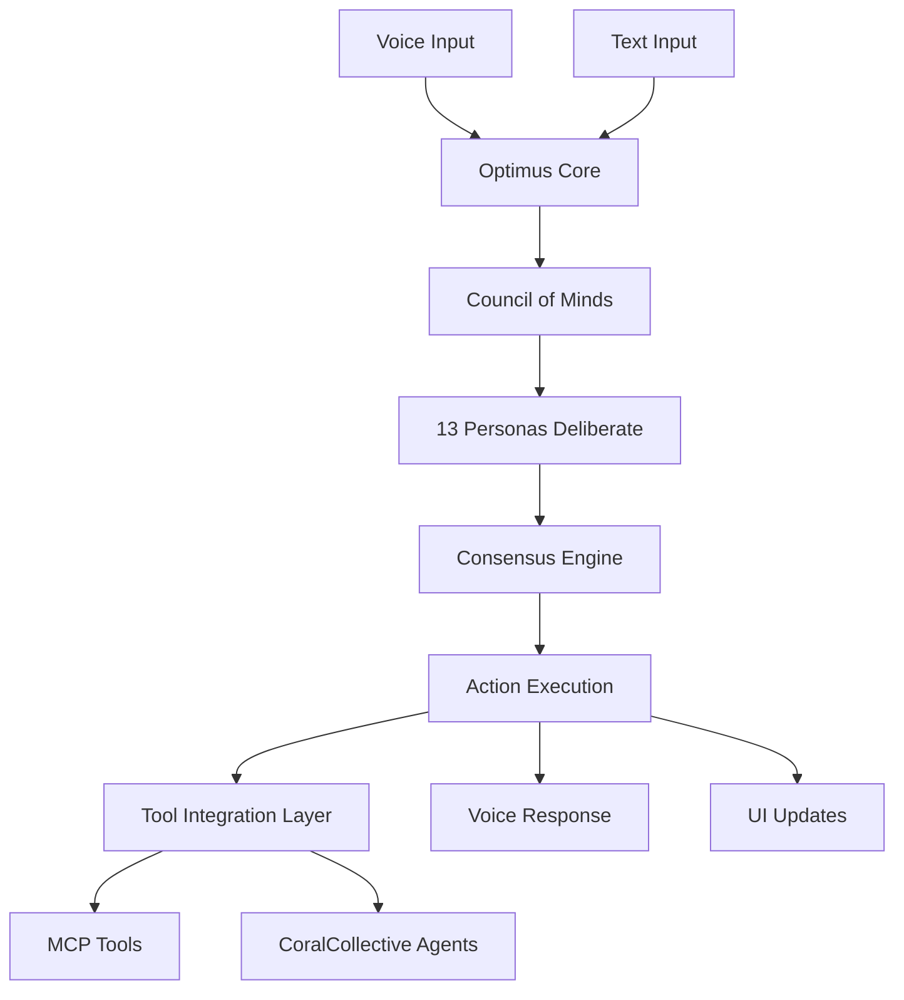

# Optimus UI Preview

## 🖥️ Current Web Dashboard

The existing UI has a modern dark-themed dashboard with:

### Main Dashboard
- **Project Overview Cards**: Shows all monitored projects with:
  - Project name and status (Active/Running/Stopped)
  - Tech stack badges (React, Python, Node.js, etc.)
  - Quality score (0-100)
  - Monetization opportunities
  - Process count and memory usage
  - Last scan timestamp

### Navigation Sidebar
- Dashboard (main view)
- Projects (detailed list)
- System Monitor (resource tracking)
- Analytics (performance metrics)
- Settings

### Key Features
- Real-time project monitoring
- Grid/List view toggle
- Search and filter capabilities
- Scan project functionality
- Quality metrics visualization

## 📱 Future Mobile App Vision (iOS/macOS)

### Optimus Assistant App Features:

#### 1. Voice Interface
- **Optimus Prime Voice**: Customizable voice system with swappable voice packs
- Natural language queries: "Optimus, how are my projects doing?"
- Voice commands: "Start monitoring the backend service"

#### 2. Council of Minds Integration
The 13 personas provide comprehensive life and technical advice:

**Technical Personas:**
- Strategist - Long-term planning
- Pragmatist - Practical solutions
- Innovator - Creative approaches
- Guardian - Security & risk
- Analyst - Data insights

**Life Aspect Personas:**
- Philosopher - Ethics & meaning
- Healer - Health & wellness
- Socialite - Relationships
- Economist - Financial planning
- Creator - Creative expression
- Scholar - Learning & education
- Explorer - Growth & adventure
- Mentor - Leadership & guidance

#### 3. Mobile UI Components

##### Home Screen
```
┌─────────────────────────┐
│ 🤖 OPTIMUS             │
│ "All systems optimal"   │
├─────────────────────────┤
│ Quick Actions:          │
│ [🎤 Voice] [💭 Ask]     │
├─────────────────────────┤
│ Active Projects: 5      │
│ ▓▓▓▓▓▓▓▓░░ 85% Health  │
├─────────────────────────┤
│ Today's Insights:       │
│ • Code review needed    │
│ • Meeting in 2 hours    │
│ • Exercise reminder     │
└─────────────────────────┘
```

##### Conversation View
```
┌─────────────────────────┐
│ < Back    Council       │
├─────────────────────────┤
│ You:                    │
│ "Should I refactor the  │
│  authentication system?"│
├─────────────────────────┤
│ Council Deliberation:   │
│ ┌─────────────────────┐ │
│ │ Strategist (85%)    │ │
│ │ "Yes, for scale..." │ │
│ ├─────────────────────┤ │
│ │ Pragmatist (65%)    │ │
│ │ "Consider timing..." │ │
│ ├─────────────────────┤ │
│ │ Guardian (90%)      │ │
│ │ "Security critical..."│ │
│ └─────────────────────┘ │
│                         │
│ Consensus: REFACTOR     │
│ Confidence: 78%         │
└─────────────────────────┘
```

##### Life Advisory Mode
```
┌─────────────────────────┐
│ Life Balance Dashboard  │
├─────────────────────────┤
│ Work      ████░░ 70%   │
│ Health    ██░░░░ 40%   │
│ Social    ███░░░ 55%   │
│ Finance   █████░ 85%   │
│ Growth    ████░░ 65%   │
├─────────────────────────┤
│ Healer suggests:        │
│ "Take a 15min walk"     │
│                         │
│ Economist notes:        │
│ "Investment opportunity"│
└─────────────────────────┘
```

#### 4. Assistant Framework Architecture



### Swappable Components Architecture:

1. **Voice Packs**
   - Optimus Prime (default)
   - JARVIS style
   - Custom recordings
   - Regional accents

2. **Persona Configurations**
   - Enable/disable specific personas
   - Adjust weighting
   - Custom persona creation

3. **Tool Integrations**
   - GitHub/GitLab
   - Jira/Linear
   - Slack/Discord
   - Calendar systems
   - Smart home devices

4. **UI Themes**
   - Dark (default)
   - Light
   - High contrast
   - Custom themes

## 🎯 Implementation Roadmap

### Phase 1: Core Assistant (Current)
- ✅ Council of Minds system
- ✅ Tool integration layer
- ✅ Memory & knowledge graph
- ⏳ API endpoints for mobile

### Phase 2: Mobile App (Next)
- [ ] React Native/SwiftUI app
- [ ] Voice interface integration
- [ ] Push notifications
- [ ] Offline mode with sync

### Phase 3: Voice & Personalization
- [ ] Optimus Prime voice synthesis
- [ ] Voice command training
- [ ] Swappable component system
- [ ] Custom persona builder

### Phase 4: Ecosystem
- [ ] Watch app
- [ ] Widget support
- [ ] Shortcuts integration
- [ ] Third-party plugins

## 🔧 Technical Stack

### Current Web:
- Frontend: React + TypeScript + Vite
- UI: Tailwind CSS + shadcn/ui
- State: Zustand + React Query

### Future Mobile:
- iOS: SwiftUI + Combine
- Cross-platform: React Native
- Voice: Whisper API + Custom TTS
- Sync: CloudKit/Firebase
- Local: Core Data/SQLite